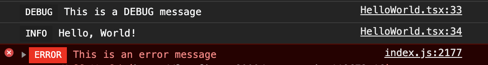
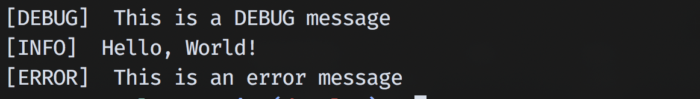

# Spartan Logger

This logger is built for minimalists.

[](https://github.com/anirudh-janga/minimalist-logger/actions)

# Features

-   Works great with React/Angular/Vue projects.
-   Works with any Javascript or Typescript applications.
-   `~700 Bytes` (0 dependencies, minified & gzipped).
-   Preserves line numbers.
-   Switch the logger to different logging levels - INFO, DEBUG, WARN, ERROR & SILENT.
-   Turn off all logging by setting SILENT LogLevel to any logger.

# Installation

## NPM

```
npm install --save spratan-logger
```

## Yarn

```
yarn add spartan-logger
```

# Usage

## Creating a new logger

### Browser logger

```
import { createLogger } from "spartan-logger";

logger = createLogger();
```

### Node logger

```
import { createNodeLogger } from "spartan-logger";

logger = createNodeLogger();
```

## Logger Levels

### Logger Level Heirarchy

- Setting a higher level will hide the lower level logs
```
DEBUG < INFO < WARN < ERROR < SILENT
```

### Setting a Logger Level

```
import { createLogger, LogLevel } from "spartan-logger";

const logger = createLogger();
logger.setLevel(LogLevel.WARN);
logger.setLevel(LogLevel.DEBUG);
```

## Use the logger to log with various levels

The default logger level is `INFO`

```
logger.debug("This is a DEBUG message");
logger.info("Hello, World!");
logger.error("This is an error message");
```

### Web logs sample



### Node logs sample



## Change to SILENT level in production

```
import { createLogger, LogLevel } from "spartan-logger";

const logger = createLogger();

if (process.env.NODE_ENV === 'production') {
    logger.setLevel(LogLevel.SILENT);
}
```
